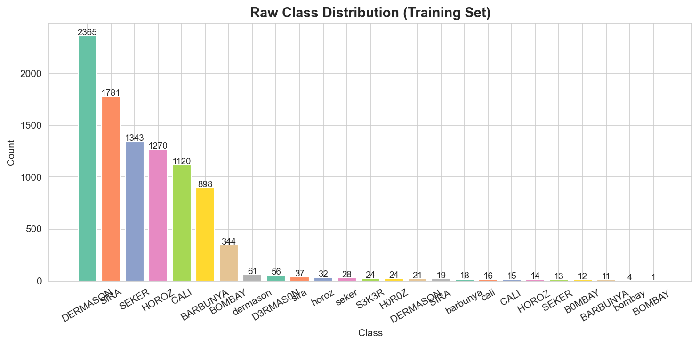
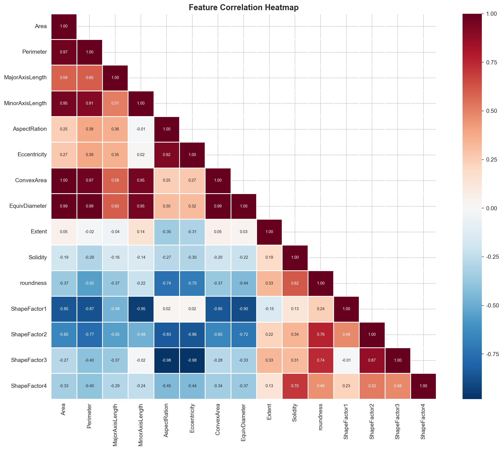
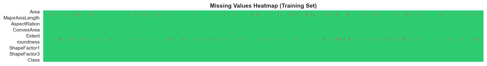
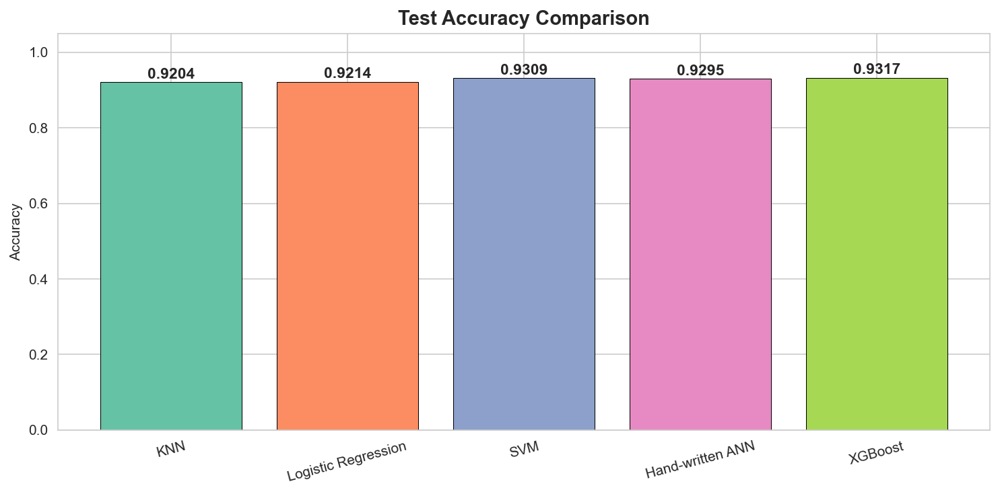
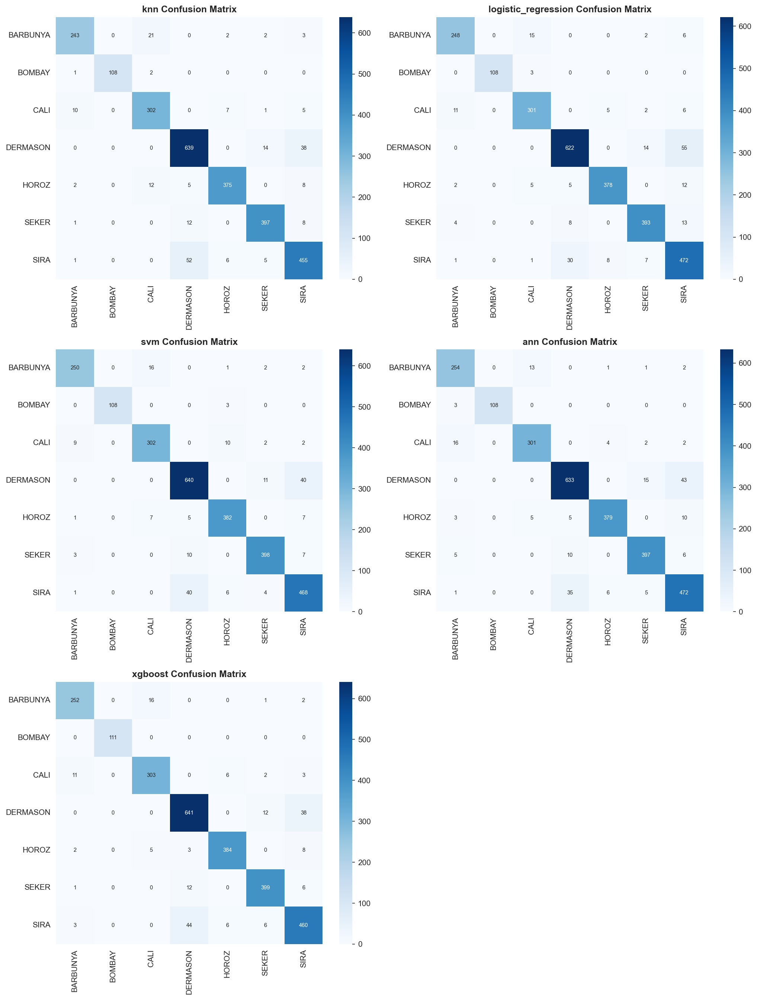
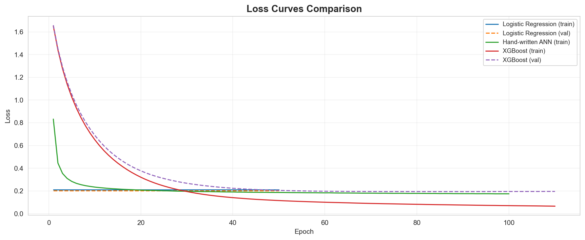
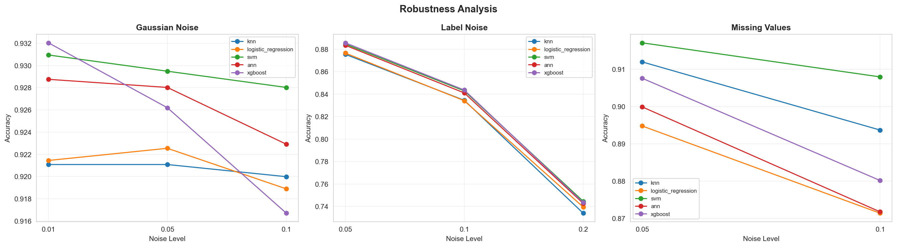
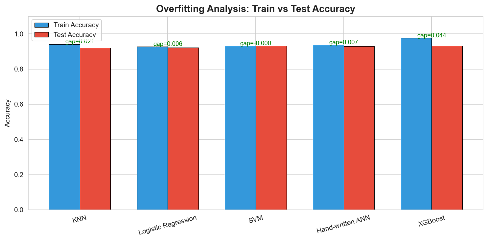

# Dry Bean Dataset —— 机器学习全流程工程

<p align="center">
  
  
  
  
  
</p>

<p align="center">
  <b>基于 UCI Dry Bean Dataset 的多分类机器学习全流程工程</b><br>
  数据分析 → 数据清洗 → 特征工程 → 多算法实验 → 多维度评估 → 系统集成
</p>

---

## 目录

- [数据集描述](#数据集描述)
- [数据污染分析](#数据污染分析)
- [数据处理方法](#数据处理方法)
- [实现的算法](#实现的算法)
- [实验结果](#实验结果)
  - [测试集精度对比](#1-测试集精度对比)
  - [Loss 曲线对比](#2-loss-曲线对比)
  - [推理速度对比](#3-推理速度对比)
  - [鲁棒性分析](#4-鲁棒性分析)
  - [过拟合分析](#5-过拟合分析)
- [工程架构](#工程架构)
- [快速开始](#快速开始)
- [课程总结](#课程总结)
- [参考文献](#参考文献)

---

## 数据集描述

| 属性 | 详情 |
|------|------|
| **来源** | [UCI Machine Learning Repository - Dry Bean Dataset](https://archive.ics.uci.edu/dataset/602/dry+bean+dataset) |
| **特征数** | 16 个数值型形态学特征 |
| **类别数** | 7 种干豆 |
| **数据划分** | 教师预先划分为 Train / Test / Val |

### 数据规模

| 数据集 | 样本量 | 特征数 | 原始类别数 |
|--------|:------:|:------:|:----------:|
| Train  | 9,527 | 16 | 25 (含噪声) |
| Test   | 2,737 | 16 | 24 (含噪声) |
| Val    | 1,347 | 16 | 24 (含噪声) |

### 16 个特征

| 特征 | 含义 | 特征 | 含义 |
|------|------|------|------|
| Area | 面积 | EquivDiameter | 等效直径 |
| Perimeter | 周长 | Extent | 延展度 |
| MajorAxisLength | 长轴长度 | Solidity | 坚实度 |
| MinorAxisLength | 短轴长度 | roundness | 圆度 |
| AspectRation | 纵横比 | Compactness | 紧凑度 |
| Eccentricity | 离心率 | ShapeFactor1 | 形状因子 1 |
| ConvexArea | 凸面积 | ShapeFactor2 | 形状因子 2 |
| — | — | ShapeFactor3 | 形状因子 3 |
| — | — | ShapeFactor4 | 形状因子 4 |

### 7 种目标类别

| 标签 | 中文名 | Train 样本量 |
|------|--------|:------------:|
| DERMASON | Dermason 豆 | 2,503 |
| SIRA | Sira 豆 | 1,837 |
| SEKER | Seker 豆 | 1,408 |
| HOROZ | Horoz 豆 | 1,340 |
| CALI | Cali 豆 | 1,151 |
| BARBUNYA | Barbunya 豆 | 927 |
| BOMBAY | Bombay 豆 | 361 |

> 数据集存在明显的类别不均衡：DERMASON 类样本量约为 BOMBAY 类的 7 倍。

### 数据可视化

<p align="center">
  
  
</p>

---

## 数据污染分析

教师提供的为 **脏数据版本 (Dirty Version)**，包含三类污染：

### 1. 缺失值

| 字段 | Train | Test | Val | 缺失形式 |
|------|:-----:|:----:|:---:|---------|
| Perimeter | 469 (~4.9%) | ~135 | ~66 | NaN |
| Solidity | 474 (~5.0%) | ~136 | ~67 | NaN + `?` 标记 |

<p align="center">
  
</p>

### 2. 标签噪声

原始标签共出现 **25 种不同值**，实际仅应有 7 种。噪声类型：

| 噪声类型 | 示例 | 涉及样本 |
|----------|------|:--------:|
| 拼写错误 (数字替换字母) | `D3RMAS0N`, `S3K3R`, `H0R0Z`, `B0MBAY` | ~116 |
| 大小写混乱 | `dermason`, `sira`, `horoz`, `cali` | ~213 |
| 尾部空格 | `DERMASON `, `SIRA `, `HOROZ ` | ~93 |

### 3. 数值字段中的非数值内容

`Compactness` 列有 258 个值包含单位后缀 `cm`（如 `0.9293 cm`），导致该列被识别为字符串类型。Compactness 实际为无量纲比值，`cm` 为标注错误。

---

## 数据处理方法

数据处理采用 **4 步流水线**，所有操作仅在训练集上拟合参数，测试集/验证集使用相同参数变换：

### 处理流程

```
原始数据 (Dirty)
    │
    ├── [Step 1] 标签清洗
    │       ├── str.strip()         去除首尾空格
    │       ├── str.upper()         统一大写
    │       └── 纠错映射字典         D3RMAS0N→DERMASON 等
    │
    ├── [Step 2] 数值清理
    │       ├── 正则去除单位后缀    \s*(cm|mm|px|in)$ → ""
    │       └── pd.to_numeric()     强制数值转换
    │
    ├── [Step 3] 缺失值填充
    │       ├── 策略：按类别分组中位数填充
    │       ├── 回退：若全类缺失 → 全局中位数
    │       └── 字段：Perimeter, Solidity
    │
    └── [Step 4] 特征标准化
            ├── StandardScaler (fit on Train only)
            └── 输出：均值 0，方差 1
```

### 处理效果汇总

| 步骤 | 方法 | 处理前 | 处理后 |
|------|------|--------|--------|
| 标签清洗 | strip + upper + 纠错映射 | 25 种标签 | **7 种标准标签** |
| 数值清理 | 正则去单位 + to_numeric | Compactness 为 object | 全数值类型 |
| 缺失值填充 | 按类别分组中位数 | ~5% 缺失 | **0 缺失** |
| 特征标准化 | StandardScaler | 量纲差异巨大 | 均值 0 / 方差 1 |

---

## 实现的算法

共实现 **5 种多分类算法**（4 课内 + 1 课外），其中 ANN 按照课程要求**从零手写实现**：

| 算法 | 类型 | 来源 | 核心配置 |
|------|------|------|----------|
| **KNN** | 距离度量 | scikit-learn | k=5, 欧氏距离, 多数投票 |
| **Logistic Regression** | 线性模型 | scikit-learn | multinomial, lbfgs, max_iter=5000 |
| **SVM** | 支持向量机 | scikit-learn | RBF 核, probability=True |
| **Hand-written ANN** | 神经网络 | **NumPy 从零手写** | [128, 64] ReLU + Softmax, He 初始化 |
| **XGBoost** ⭐ | 梯度提升 | xgboost | n=200, lr=0.1, early_stopping=20 |

> ⭐ = 课外自学算法

### 手写 ANN 架构细节

```
输入层 (16) → 隐藏层1 (128, ReLU) → 隐藏层2 (64, ReLU) → 输出层 (7, Softmax)
```

| 组件 | 实现 |
|------|------|
| 权重初始化 | He 初始化: W ~ N(0, √(2/n_in)) |
| 前向传播 | Z = W·A + b → ReLU → Softmax |
| 损失函数 | 多分类交叉熵: L = -(1/m)·ΣΣ y·log(p) |
| 反向传播 | 链式法则逐层求梯度, ReLU': 1(Z>0) |
| 优化器 | Mini-batch SGD, batch=64, lr=0.01, epochs=100 |

---

## 实验结果

### 1. 测试集精度对比

| 算法 | Accuracy | Precision(M) | Recall(M) | F1(Macro) |
|------|:--------:|:------------:|:---------:|:---------:|
| KNN | 0.9204 | 0.9328 | 0.9261 | 0.9293 |
| Logistic Regression | 0.9214 | 0.9339 | 0.9292 | 0.9312 |
| SVM | 0.9309 | 0.9416 | 0.9364 | 0.9390 |
| Hand-written ANN | 0.9295 | 0.9386 | 0.9363 | 0.9373 |
| **XGBoost** ⭐ | **0.9317** | **0.9424** | **0.9408** | **0.9416** |

<p align="center">
  
  
</p>

> **结论**: XGBoost 以 93.17% 准确率最优；手写 ANN 仅差 SVM 0.14%，验证了手写实现的正确性。

### 2. Loss 曲线对比

<p align="center">
  
</p>

- XGBoost 收敛最快 (~20 轮), 得益于 early stopping
- Logistic Regression 和手写 ANN 均平滑收敛，无震荡

### 3. 推理速度对比

| 算法 | 总推理时间 (ms) | 单样本 (ms) | 排名 |
|------|:---------------:|:-----------:|:----:|
| Logistic Regression | ~0.00 | ~0.0000 | 最快 |
| Hand-written ANN | ~0.00 | ~0.0000 | 最快 |
| XGBoost | 4.02 | 0.0015 | 快 |
| KNN | 60.80 | 0.0222 | 较慢 |
| SVM (RBF) | 234.73 | 0.0858 | 最慢 |

> 逻辑回归和 ANN 仅为矩阵乘法，速度最快；SVM 的 RBF 核计算开销最大。

### 4. 鲁棒性分析

在测试集上施加 3 类噪声，观察各算法精度退化：

<p align="center">
  
</p>

| 噪声类型 | 强度范围 | 精度下降 | 最鲁棒算法 |
|----------|:--------:|:--------:|:----------:|
| 高斯噪声 | σ=0.01~0.10 | ~1% | 全部优秀 |
| 标签噪声 | 5%~20% | **~19%** | XGBoost |
| 额外缺失值 | 5%~10% | 1~5% | SVM / XGBoost |

> **结论**: 标签噪声是最致命的数据污染；XGBoost 在所有噪声类型下鲁棒性最佳。

### 5. 过拟合分析

| 算法 | 训练集 Acc | 测试集 Acc | 过拟合 Gap | 评估 |
|------|:----------:|:----------:|:----------:|:----:|
| KNN | 0.9415 | 0.9204 | 0.0212 | 轻微 |
| Logistic Regression | 0.9272 | 0.9214 | 0.0057 | 几乎无 |
| SVM | 0.9309 | 0.9309 | -0.0000 | 无 |
| Hand-written ANN | 0.9363 | 0.9295 | 0.0068 | 几乎无 |
| XGBoost | 0.9758 | 0.9317 | 0.0441 | 中等 |

<p align="center">
  
</p>

> XGBoost 过拟合 Gap 最大 (4.4%)，属于树集成方法的典型特征，但测试集精度仍最高，在可接受范围内。

---

## 工程架构

```
homework/
├── 数据/                                # 原始数据集
│   ├── Dry_Bean_Dataset_Dirty_train.csv
│   ├── Dry_Bean_Dataset_Dirty_test.csv
│   └── Dry_Bean_Dataset_Dirty_val.csv
│
├── src/                                 # 源代码模块
│   ├── __init__.py
│   ├── data_loader.py                   # 数据加载 + 编码处理 + 特殊值识别
│   ├── preprocessor.py                  # 4步预处理流水线
│   ├── noise_generator.py               # 鲁棒性测试噪声注入
│   ├── visualizer.py                    # matplotlib + seaborn 可视化
│   ├── trainer.py                       # 统一训练调度 + 模型持久化
│   ├── evaluator.py                     # 5维度评估系统
│   └── algorithms/                      # 算法实现
│       ├── __init__.py
│       ├── base.py                      # 基类 + 工厂模式
│       ├── knn_classifier.py            # KNN (课内)
│       ├── logistic_regression.py       # 逻辑回归 (课内)
│       ├── svm_classifier.py            # SVM (课内)
│       ├── ann_classifier.py            # 手写 ANN (课内)
│       ├── xgboost_classifier.py        # XGBoost (课外)
│       └── random_forest.py             # 随机森林 (备用)
│
├── outputs/                             # 所有输出
│   ├── figures/
│   │   ├── data_analysis/               # 4 张数据分析图
│   │   └── evaluation/                  # 6 张评估对比图
│   ├── models/                          # 训练好的模型文件 (.pkl)
│   └── results/                         # CSV + JSON 数值结果
│
├── main.py                              # CLI 统一入口 (5 个子命令)
├── requirements.txt                     # Python 依赖
├── build_paper.js                       # 论文生成脚本
└── README.md                            # 本文件
```

### 命令行接口

```bash
python main.py analyze         # Step 1: 数据分析 + 生成图表
python main.py preprocess      # Step 2: 数据预处理
python main.py train           # Step 3: 训练所有算法
python main.py evaluate        # Step 4: 多维度评估
python main.py full-pipeline   # 一键运行全流程
```

> 所有命令均为纯 CLI 输出，算法运行阶段无 UI 界面。

---

## 快速开始

### 环境要求

- Python >= 3.8
- pip

### 安装

```bash
# 克隆仓库
git clone https://github.com/xiaopojiuguan/homework.git
cd homework

# 安装依赖
pip install -r requirements.txt
```

### 运行

```bash
# 一键运行完整流程
python main.py full-pipeline
```

### 输出说明

| 目录 | 内容 |
|------|------|
| `outputs/figures/data_analysis/` | 类别分布图、特征分布图、相关性热力图、缺失值热力图 |
| `outputs/figures/evaluation/` | 精度对比、混淆矩阵、Loss曲线、推理速度、鲁棒性、过拟合分析 |
| `outputs/models/` | 5 个训练好的模型 (.pkl) |
| `outputs/results/` | accuracy_comparison.csv, full_results.json, robustness.csv |

---

## 课程总结

通过本学期的机器学习课程，系统掌握了以下内容：

1. **机器学习基础理论** — 监督学习、偏差-方差权衡、过拟合/欠拟合、交叉验证
2. **经典分类算法** — KNN、Logistic Regression、SVM 的数学原理与工程实现
3. **神经网络** — 前向传播 + 反向传播的完整推导与 NumPy 手写实现
4. **数据预处理** — 缺失值处理、标签清洗、特征标准化的工程化方法
5. **模型评估方法论** — 精度 / Loss / 推理速度 / 鲁棒性 / 过拟合 5 维度对比
6. **工程化能力** — 模块化项目组织、CLI 工具构建、可复现实验流程

---

## 参考文献

[1] Koklu, M., & Ozkan, I. A. (2020). Multiclass Classification of Dry Beans Using Computer Vision and Machine Learning Techniques. *Computers and Electronics in Agriculture*, 174, 105507.

[2] UCI Machine Learning Repository. Dry Bean Dataset. https://archive.ics.uci.edu/dataset/602/dry+bean+dataset

[3] Chen, T., & Guestrin, C. (2016). XGBoost: A Scalable Tree Boosting System. *KDD 2016*.

[4] Scikit-learn: Machine Learning in Python. https://scikit-learn.org/

[5] He, K., et al. (2015). Delving Deep into Rectifiers: Surpassing Human-Level Performance on ImageNet Classification. *ICCV 2015*.

[6] Bishop, C. M. (2006). *Pattern Recognition and Machine Learning*. Springer.

[7] Goodfellow, I., Bengio, Y., & Courville, A. (2016). *Deep Learning*. MIT Press.

---

<p align="center">
  <b>机器学习期末大作业</b> | 2026 年 6 月<br>
  <sub>所有实验数值由 <code>python main.py full-pipeline</code> 自动生成</sub>
</p>
